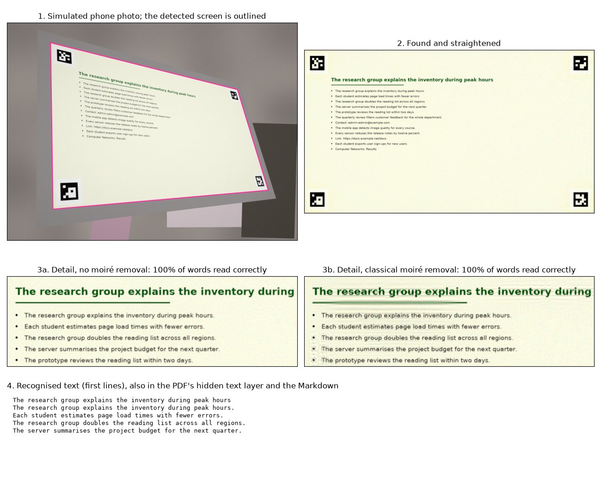

# ScreenClean

**Turn phone photos of screens into clean, readable pages and searchable text.**

[](https://github.com/ananya-baweja/screenclean/actions/workflows/ci.yml)
[](https://colab.research.google.com/github/ananya-baweja/screenclean/blob/main/notebooks/colab_runner.ipynb)

> **Status: in development.** The scan pipeline works end to end on a laptop CPU, with a classical
> moiré filter. The trained model, web app and API are being built next.

## The problem

People photograph screens all the time: lecture slides, an error message on a colleague's monitor,
a dashboard on a meeting-room TV. Those photos come out with **moiré** (wavy rainbow bands), glare and
a skewed angle. They're hard to read, and OCR tools misread them.

## What it does

- **Single photo:** finds the screen in the photo, removes moiré, straightens the page, and returns
  a clean image plus the text, ready to copy.
- **Slides to notes:** several photos of slides become one searchable PDF and a Markdown file with
  the text of every slide.
- **API:** the same features over HTTP, for other apps.

Under the hood:

- a classical screen detector
- a lightweight wavelet U-Net (**ScreenCleanNet**, 4.65 M parameters; [architecture](docs/architecture.md))
  trained in PyTorch on real 4K moiré pairs (UHDM), plus text pairs from a physics-based moiré simulator
- OCR and export

The model is compared with classical signal-processing baselines (chroma low-pass, FFT notch filters)
and a published reference model. The evaluation focuses on **OCR accuracy on real phone photos of
screens**. See [docs/USE_CASES.md](docs/USE_CASES.md) for the user stories and target metrics.

## Scan photos of screens

Needs [Tesseract 5](https://tesseract-ocr.github.io/tessdoc/Installation.html) for the text (set
`TESSERACT_CMD` if it isn't on your PATH).

```bash
pip install -e .
python -m screenclean scan path/to/photos --pdf notes.pdf --md notes.md --pages pages
```

For every photo it finds the screen, straightens the page, evens out the lighting and
reads the text. `notes.pdf` has one page per photo with a hidden text layer, so you can search and
copy; `notes.md` has the text. Options: `--mode photo` (keep the original look), `--json details.json`
(corners, text lines with boxes, timings per stage), `--cleaner fft_notch_local` (a classical moiré filter;
off by default because it can hurt text, until the trained model replaces it).



*A synthetic example: a test page on a simulated screen, photographed by a simulated phone. More results
and what they taught us: [docs/USE_CASES.md](docs/USE_CASES.md#a-first-worked-example-slides-to-searchable-notes).*

## Data

- **UHDM** (ECCV 2022): 5,000 real 4K pairs of screen photos with and without moiré.
  [Paper](https://arxiv.org/abs/2207.09935) · [code and official data links](https://github.com/CVMI-Lab/UHDM).
  Read from a pinned public mirror; see [docs/DECISIONS.md](docs/DECISIONS.md). Images are never stored in this repo.

## Repository layout

| Path | Contents |
|---|---|
| `src/screenclean/` | the Python package (data, simulator, baselines, model, training, evaluation, product pipeline) |
| `jobs/queue/` | job specs for the Colab runner ([how it works](jobs/README.md)) |
| `notebooks/colab_runner.ipynb` | the Colab runner (generated by `tools/make_runner_nb.py`) |
| `results/jobs/` | small result files from finished jobs |
| `results/checks/` | local measurements (screen detection, scan demo) |
| `capture_kit/` | 40 test pages with corner markers + slideshow for the real-photo benchmark ([guide](docs/capture_guide.md)) |
| `docs/` | design decisions and project docs |
| `tests/` | unit tests on tiny synthetic inputs |

## Development

```bash
python -m venv .venv && source .venv/bin/activate   # Windows: .venv\Scripts\activate
pip install torch torchvision --index-url https://download.pytorch.org/whl/cpu
pip install -e ".[dev]"
pytest -m "not slow"
```

Or run `bash tools/dev_setup.sh`.
