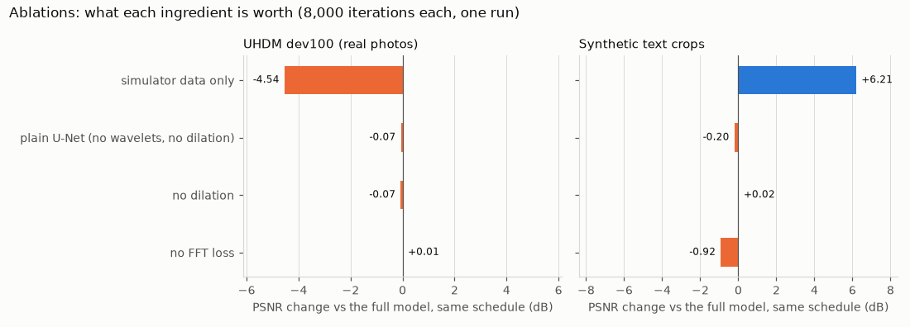
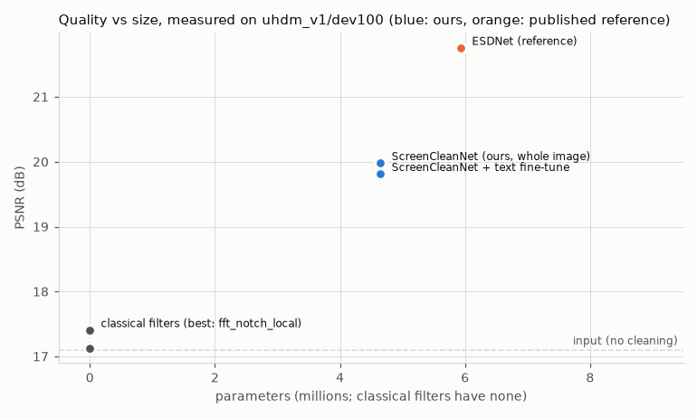
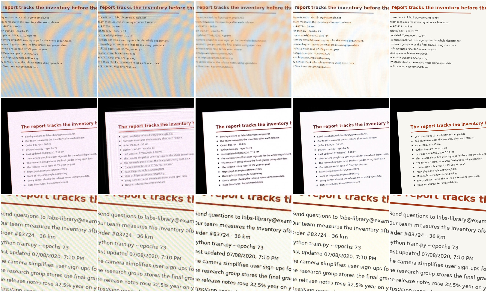
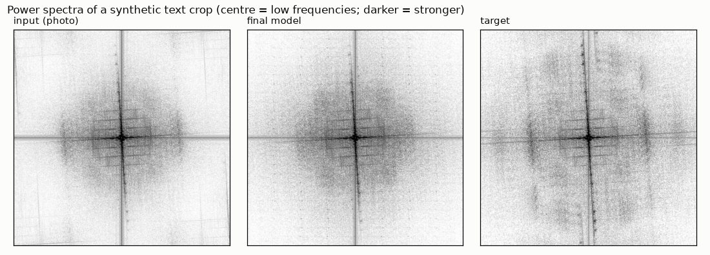
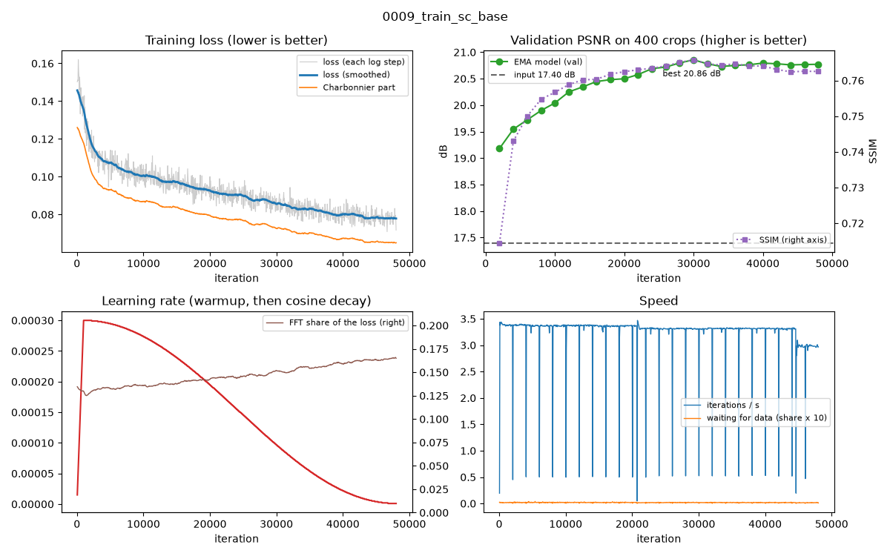
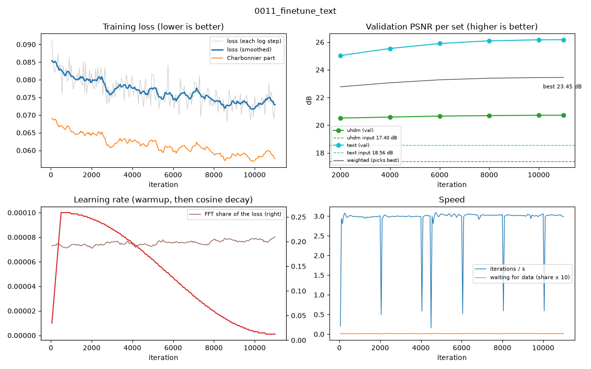

# Results

Generated by `python -m screenclean report` from `results/jobs/*/summary.json`; don't edit by hand.
Intervals are 95% paired-bootstrap confidence intervals (10,000 resamples, seed 0).

## 1. Moiré removal on real 4K photos (UHDM)

### Full test set (500 pairs; used once)

*Pending: job `0021/0022_eval_test500` (the 500-pair UHDM test set).*

### dev100 (100 test pairs used during development)

| Method | PSNR (dB) ↑ | Δ PSNR vs input | SSIM ↑ | LPIPS ↓ | s / image | Images |
|---|---|---|---|---|---|---|
| Input (no cleaning) | 17.10 | – | 0.5033 | 0.5201 | 0.03 | 100 |
| ScreenCleanNet (ours, whole image) | 19.98 | +2.88 | 0.7506 | 0.3111 | 2.37 | 100 |
| ScreenCleanNet (ours, 512 px tiles) | 19.83 | +2.73 | 0.7508 | 0.3006 | 3.63 | 100 |
| ScreenCleanNet + text fine-tune | 19.81 | +2.72 | 0.7418 | 0.3166 | 2.24 | 100 |
| fft_notch_local | 17.41 | +0.31 | 0.5321 | – | 13.73 | 100 |
| fft_notch | 17.17 | +0.07 | 0.5045 | – | 12.67 | 100 |
| chroma_lowpass | 17.13 | +0.03 | 0.5057 | – | 0.78 | 100 |
| ESDNet (reference) | 21.76 | +4.66 | 0.7881 | 0.2696 | 1.16 | 100 |

## 2. Synthetic text pages (300 simulated crops)

| Method | PSNR (dB) ↑ | Δ PSNR vs input | SSIM ↑ | LPIPS ↓ | s / image | Images |
|---|---|---|---|---|---|---|
| Input (no cleaning) | 19.37 | – | 0.5728 | 0.4600 | 0.00 | 300 |
| ScreenCleanNet + text fine-tune | 26.21 | +6.85 | 0.8927 | 0.1432 | 0.07 | 300 |
| ScreenCleanNet (ours, whole image) | 22.53 | +3.17 | 0.8039 | 0.2215 | 0.07 | 300 |
| fft_notch_local | 19.10 | -0.27 | 0.5602 | 0.4658 | 0.27 | 300 |

## 3. Ablations

Each variant trained from scratch for 8,000 iterations and scored on its final weights
(one run each; differences under ~0.1 dB are within noise).

| Variant | dev100 PSNR | Δ vs full | dev100 LPIPS | text PSNR | Δ vs full |
|---|---|---|---|---|---|
| full model, short schedule | 19.32 | +0.00 | 0.337 | 21.73 | +0.00 |
| no FFT loss | 19.33 | +0.01 | 0.359 | 20.82 | -0.92 |
| no dilation | 19.25 | -0.07 | 0.340 | 21.75 | +0.02 |
| plain U-Net (no wavelets, no dilation) | 19.26 | -0.07 | 0.346 | 21.53 | -0.20 |
| simulator data only | 14.78 | -4.54 | 0.442 | 27.94 | +6.21 |

## 4. OCR on synthetic text crops

*Pending: job `0019_eval_synth_ocr` (PaddleOCR and Tesseract on the synthetic text crops).*

## 5. OCR on real phone photos (same geometry for every method)

*Pending: job `0025_eval_real_ocr` (needs the phone photos on Drive and job 0024).*

## 6. The product end to end

*Pending: job `0025_eval_real_ocr` (screen detection, end-to-end CER by cleaner, seconds per photo).*

## 7. Size and speed

*Pending: job `0023_efficiency` (parameters, FLOPs, T4 and CPU latency).*

## Figures

Synthetic text crops, left to right: photo, classical filter, ScreenCleanNet before the text
fine-tune, the final model, target.

Power spectra of the crop whose photo differs most from its target. The photo's faint lines
near the corners are aliased copies of the display's pixel grid; the model's output has none,
but it is also lighter than the target far from the centre: some fine detail of the letters
is smoothed away.

